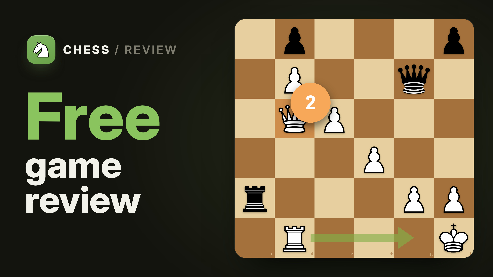

# ♟ Chess Review

Free, open-source game review for your online chess games, powered by Stockfish NNUE running
locally in your browser. One click turns any **Chess.com** or **Lichess** game into a full
review — accuracy scores, move-by-move classifications, an evaluation graph, and an estimated
rating. No account, no server, no manual PGN copying.

The right-hand Settings panel includes an optional **Concepts** tab after Visual
and Engine. A separate **Concepts** panel to the right of Accuracy and Engine
uses those same findings,
ordered by likely relevance and phrased from your playing side. It follows the
selected move, includes every match, and separates insights with space. Its top
aligns with the coach commentary panel; its bottom aligns with Engine. Expand
an insight's evidence to inspect the original explanation and exact scope.
Accuracy and the existing move commentary retain their scoring and behavior.

The Settings Concepts panel remains the raw inspection and game-debug view.
Check **Enable concept analysis** to list supported findings for the
selected move, with exact verified scopes and game-wide debug metrics. It defaults
off and stops its worker immediately when disabled. Findings use completed E080
research's bounded mechanics; broader strategic benefits and coaching usefulness
remain unproven. Existing scores and coach comments are unchanged.

**Source:** https://github.com/T-Julsgaard/Chess-Review

**Chrome webshop**: https://chromewebstore.google.com/detail/chess-review/pdbffcjdmcadihmnmenkadndbdbigfam

**Firefox Add-ons**: https://addons.mozilla.org/en-US/firefox/addon/chess-review/

## Watch the introduction

Click the image below to watch the introduction video.

[](https://t-julsgaard.github.io/Chess-Review/marketing/video/media/chess-review-intro.mp4)

## Features

- **One-click review** of any Chess.com or Lichess game — or paste a game URL / raw PGN.
- **Accuracy estimates** for both players, calculated from local Stockfish analysis using the extension's scoring rules. Scores can differ from other review tools.
- **Move classifications** from Brilliant to Blunder, with an evaluation graph and best-move arrows.
- **Estimated rating** — a rough guide to the level each player performed at in the game.
- **Opening detection** from an offline book, named even for PGNs without headers.
- **Rated alternatives** while reviewing a game, using the same classification rules
  as the played moves. Exploring does not change the original game or its accuracy.
- **Stockfish 18 NNUE is the default**, with **Stockfish 19 Lite** as a compact
  alternative. Both are bundled locally and available in Settings.
- **Recoverable analysis errors** with a Retry button; unfinished reviews are not
  saved as completed games.
- **Analysis runs on your machine** — game lookup requests go directly to the chess platforms; no developer backend or analytics.

## Usage

1. Open a finished game on **Chess.com** or **Lichess**.
2. Click the extension icon → **Analyze this game**, or press `Ctrl+Shift+Y`.
3. Stockfish reviews the game in an analysis tab.

You can also paste a game URL or PGN into the popup. If your username cannot be
detected, enter it once; it is remembered locally. Chess Review is intended for
review after play.

Settings let you choose an engine, rating mode, board, pieces, sounds, coach and
category-badge appearance. Badge numbers describe move categories; they are
separate from position evaluation and game accuracy.

Both engines offer **Use recorded rating** and **Moves only**. The first compares
your performance with public players near the rating saved in the game; the
second ignores that rating and estimates a blitz rating level from your choices.
Without a saved rating, the review falls back to Moves only, which needs at least
ten nonforced decisions. Each engine uses its own models.

## Scoring and reproducibility

Chess Review is open source and uses local Stockfish analysis with documented
scoring models. The repository includes the fitting tools, public-data evidence
and reference results needed to inspect and reproduce the bundled numerical
models.

With Node.js 24 or later, reproduce the bundled coefficients and reference scores
offline:

```sh
node tools/calibration/reproduce-public.mjs
```

This check replays the included evidence without rerunning engine searches. The
[methodology](tools/calibration/PUBLIC_METHOD.md) documents the inputs,
calculations and limitations. Estimated ratings are approximate.

Move categories follow documented classification rules. See the
[special annotations guide](tools/calibration/BRILLIANT_MOVES.md) for their
definitions and sources, and the [repository guide](docs/REPOSITORY.md) for the
supporting files.

## Research and future methods

The separate [research workspace](research/README.md) investigates improvements
to accuracy, estimated ratings and move categories against our own documented
baseline. It records reproducible experiments, successful and unsuccessful
findings, evidence limits and implementation decisions. Research candidates
become part of the extension only through a documented promotion. See the
[research index](research/INDEX.md) for current state and next questions.

## Install

Install from the Chrome Web Store or Firefox Add-ons using the links above.
For a local Chrome installation:

1. Download or clone this repository.
2. Open `chrome://extensions` and enable **Developer mode** (top-right).
3. Click **Load unpacked** and select the project folder.


## Privacy

Games are fetched from Chess.com's and Lichess's public APIs and analyzed locally
with bundled WebAssembly builds of Stockfish. Lookup requests include public player
usernames or game IDs. No games or analysis are sent to the developer or analytics services.
Firefox discloses the browsing activity and website content used for these requests.
Sharing a game copies an encoded, unencrypted PGN/metadata link to your clipboard;
anyone you send it to can read that information. See [PRIVACY.md](PRIVACY.md).

## Release packages

Run `npm ci`, `npm test`, `npm run verify:engines`, and `npm run build`.
The build creates separate Chrome and Firefox ZIPs under `web-ext-artifacts/`,
with browser-specific manifests and no development dependencies or tests. Each build
has its own release directory, source snapshot, and SHA-256 package checksums.
See [RELEASE.md](RELEASE.md) for store reviewer notes and validation commands.

## Contributors

Developed and maintained by [T-Julsgaard](https://github.com/T-Julsgaard), with
AI-assisted contributions from OpenAI Codex to code, research, tests, and documentation.
See [CONTRIBUTING.md](CONTRIBUTING.md) to contribute to the project.

## License & attributions

Chess Review's own code is licensed under the **GNU General Public License v3.0** (see
[`LICENSE`](LICENSE)), matching the bundled Stockfish engine. Bundled third-party assets (engine,
pieces, sounds, opening book, libraries) keep their own licenses — see
[`ATTRIBUTIONS.md`](ATTRIBUTIONS.md) and [`THIRD_PARTY_NOTICES.md`](THIRD_PARTY_NOTICES.md).
Some asset redistribution rights remain unresolved as documented in the attributions;
the project's GPL license does not grant rights to those assets.
Corresponding source for the GPL/AGPL components is available
from the upstream projects listed there.

> **Disclaimer:** Chess Review is an independent, unofficial tool. It is **not affiliated with,
> endorsed by, or sponsored by Chess.com or Lichess**. Those names are used only to describe the
> sites it reads games from (nominative reference); all trademarks belong to their respective owners.
